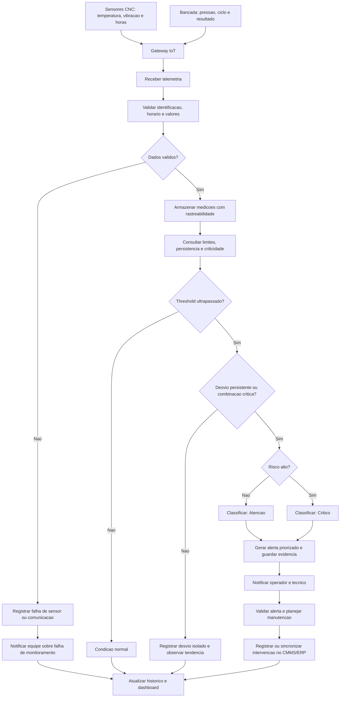
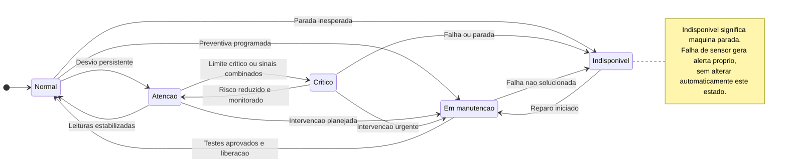

# Projeto IoT Industrial — Diagramas Mermaid

## 1. Fluxo de telemetria e verificação de thresholds

```mermaid
flowchart TD
    CNC["Sensores CNC: temperatura, vibracao e horas"] --> GW["Gateway IoT"]
    BAN["Bancada: pressao, ciclo e resultado"] --> GW
    GW --> ING["Receber telemetria"]
    ING --> VAL["Validar identificacao, horario e valores"]
    VAL --> OK{"Dados validos?"}
    OK -- Nao --> FALHA["Registrar falha de sensor ou comunicacao"]
    FALHA --> AVISO["Notificar equipe sobre falha de monitoramento"]
    AVISO --> DASH["Atualizar historico e dashboard"]
    OK -- Sim --> BD["Armazenar medicoes com rastreabilidade"]
    BD --> REGRAS["Consultar limites, persistencia e criticidade"]
    REGRAS --> LIMITE{"Threshold ultrapassado?"}
    LIMITE -- Nao --> NORMAL["Condicao normal"]
    NORMAL --> DASH
    LIMITE -- Sim --> CONF{"Desvio persistente ou combinacao critica?"}
    CONF -- Nao --> OBS["Registrar desvio isolado e observar tendencia"]
    OBS --> DASH
    CONF -- Sim --> RISCO{"Risco alto?"}
    RISCO -- Nao --> ATENCAO["Classificar: Atencao"]
    RISCO -- Sim --> CRITICO["Classificar: Critico"]
    ATENCAO --> ALERTA["Gerar alerta priorizado e guardar evidencia"]
    CRITICO --> ALERTA
    ALERTA --> NOTIF["Notificar operador e tecnico"]
    NOTIF --> ACAO["Validar alerta e planejar manutencao"]
    ACAO --> CMMS["Registrar ou sincronizar intervencao no CMMS/ERP"]
    CMMS --> DASH
```

## 2. Máquina de estados do equipamento

```mermaid
stateDiagram-v2
    direction LR
    state "Normal" as Normal
    state "Atencao" as Atencao
    state "Critico" as Critico
    state "Em manutencao" as Manutencao
    state "Indisponivel" as Indisponivel

    [*] --> Normal
    Normal --> Atencao: Desvio persistente
    Atencao --> Critico: Limite critico ou sinais combinados
    Atencao --> Normal: Leituras estabilizadas
    Critico --> Atencao: Risco reduzido e monitorado
    Normal --> Manutencao: Preventiva programada
    Atencao --> Manutencao: Intervencao planejada
    Critico --> Manutencao: Intervencao urgente
    Normal --> Indisponivel: Parada inesperada
    Critico --> Indisponivel: Falha ou parada
    Indisponivel --> Manutencao: Reparo iniciado
    Manutencao --> Normal: Testes aprovados e liberacao
    Manutencao --> Indisponivel: Falha nao solucionada

    note right of Indisponivel
        Indisponivel significa maquina parada.
        Falha de sensor gera alerta proprio,
        sem alterar automaticamente este estado.
    end note
```
